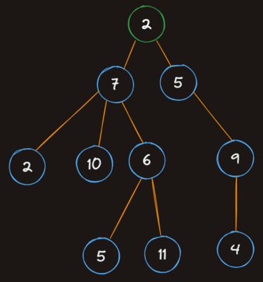

# Trees

[Trees](https://en.wikipedia.org/wiki/Tree_(abstract_data_type)) are a widely used data structure that simulate a hierarchical... well... *tree* structure. That said, they're typically drawn upside down - the "root" node is at the top, and the "leaves" are at the bottom.



Trees are kind of like linked lists in the sense that the root node simply holds references to its child nodes, which in turn hold references to their children, but Tree's nodes can have *multiple* children instead of just one. A generic tree structure has the following rules:

- Each node has a value and *may* have a list of "children"
- Children can only have a single "parent"

### Linked List

```
node -> node -> node
```

### Tree

*Drawn from left to right in this case*:

```
         > node
      > node
   > node
> node
         > node
      > node
         > node
      > node
   > node
      > node
```

---

### Multiple nodes in a tree can have the same value

- (x) Sure, why not?
- ( ) Nope

### Parent nodes can have ____ child(ren), and children can have ____ parent(s)

- ( ) one, multiple
- (x) multiple, one