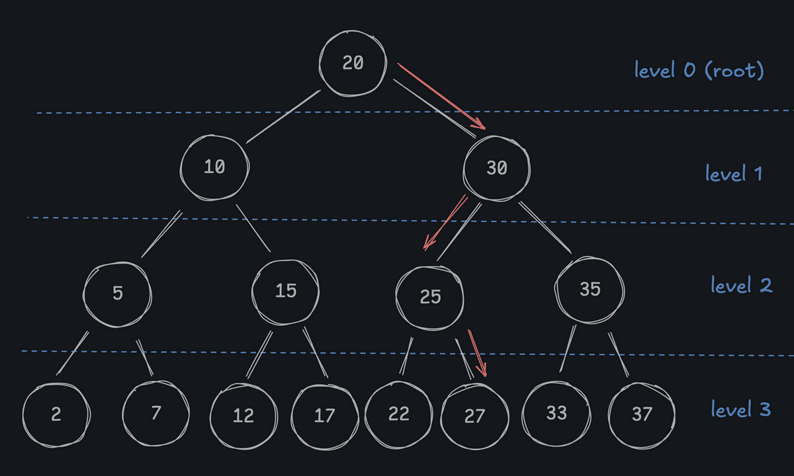

# Insert Review

Inserting into a binary search tree (like most of its operations) is *very fast*. Picture the algorithm that you just wrote in your head: ***how many comparisons does it take to find the right spot for a new node***?

It only requires one comparison for each *level* of the tree, making it `O(log(n))`! (At least in a balanced tree, we'll talk about this later).

Order `log(n)` is *very* fast - it's practically as good as `O(1)` in most cases. If our tree has `1,000,000` nodes, we only need to make `20` comparisons to find the right spot for a new node. If our tree is 2x larger (`2,000,000` nodes), we only need to make one more comparison per insert, `21` total.

---

### What is the average Big O complexity of the `.insert` method?

- ( ) `O(n^2)`
- ( ) `O(n)`
- (x) `O(log(n))`
- ( ) `O(1)`