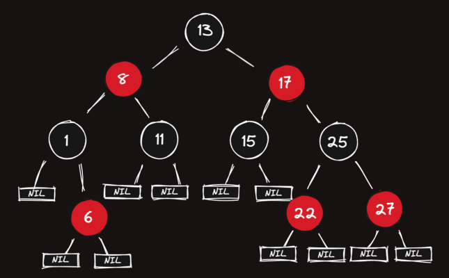

# Red-Black Tree

A [red-black](https://en.wikipedia.org/wiki/Red%E2%80%93black_tree) tree is a *kind* of binary search tree that solves the "balancing" problem. It contains a bit of extra logic to ensure that as nodes are inserted and deleted, the tree remains relatively balanced.

### How It Works

Each node in an RB Tree stores an extra bit, called the "color": either red or black. The "color" ensures that the tree remains approximately balanced during insertions and deletions. When the tree is modified, the new tree is rearranged and repainted to restore the coloring properties that constrain how unbalanced the tree can become in the worst case.

<blockquote style="border-left: 5px solid #6c7db0; padding: 5px 10px; margin: 10px auto">
The "red" and "black" nomenclature is arbitrary - you could call them "red vs blue" trees (shout-out rooster teeth), or not even call it "color" at all. The important part is just that we now have two "types" of nodes and that will affect the algorithm for balancing it.
</blockquote>

### List of Very Simple Rules

- Each node is either red or black.
- The root is black.
- All Nil leaf nodes are black.
- If a node is red, then both its children are black.
- All paths from a single node go through the same number of black nodes to reach any of its descendant Nil (black) nodes.

## Assignment

As it turns out, we've been inserting user records into our tree with incrementing numerical IDs (pre sorted data)! The app's user lookups are starting to get really slow. Let's start implementing a Red-Black tree to speed things up.

In a normal `BST`, the child nodes don't need to know about, or carry a reference to their parent. The same is not true for Red-Black trees.

The `RBNode` class is already implemented for you, as well as the `__init__` constructor method of the `RBTree` class. There's also a data member, `self.nil` created for you in the constructor. `self.nil` contains the value we'll use to designate all the `nil` (empty) leaf nodes, which are used for rebalancing purposes but contain no "actual" value.

<blockquote style="border-left: 5px solid #6c7db0; padding: 5px 10px; margin: 10px auto">
nil is a <strong>single</strong> instance of <code>RBNode</code> that can be referenced in many different places
</blockquote>

**Complete the `insert` method**. It should take a value as input and add the value as a new node in the tree if the value doesn't already exist.

0. [x] if the `root` node is `nil` set the `new_node` as the `root` of the tree
1. [x] Create the `new_node`:
   1. [x] Create a new `RBNode` from the given input value
   2. [x] The `new_node` shouldn't have a parent yet
   3. [x] The `new_node`'s left and right children should be `nil`
   4. [x] The `new_node` is red. (`new_node.red = True`)
2. [x] Find the parent of the `new_node` if there will be one:
   1. [x] Initialize a `parent` variable to None
   2. [x] Initialize a `current` variable to the root node of the tree
   3. [x] While `current` isn't a `nil` node:
      1. [x] Set `parent` to the `current`
      2. [x] If the `new_node`'s value is less than the `current` node's, set `current` to its own left child. If `new_node`'s value is greater, set `current` to its own right child. If the values are equal, just `return` because this value is a duplicate.
   4. [x] If you followed the steps correctly, `parent` will be a reference to the node that will become the parent of the `new_node`
3. [x] Insert the `new_node` as parent's child by its value:
   1. [x] Set the `new_node`'s parent to the parent we just found
   <!-- 2. [x] If the parent is `None`, we are dealing with a new root, so set the tree's `root` data member to the `new_node` -->
   3. [x] <!-- Otherwise,  -->compare the values of the parent and `new_node` and set it to the parent's `left` or `right` child based on the results

We're done for now! We've *really* just made another (more complicated) regular binary tree, seeing as it's not a fully-fledged red-black tree yet... but these upgrades will allow us to implement the rest of the logic in the next few lessons.

So far we've added:

- a `parent` pointer from child to parent (so children know who their parents are)
- the mechanisms for coloring the nodes, but have defaulted them all to `red` for now