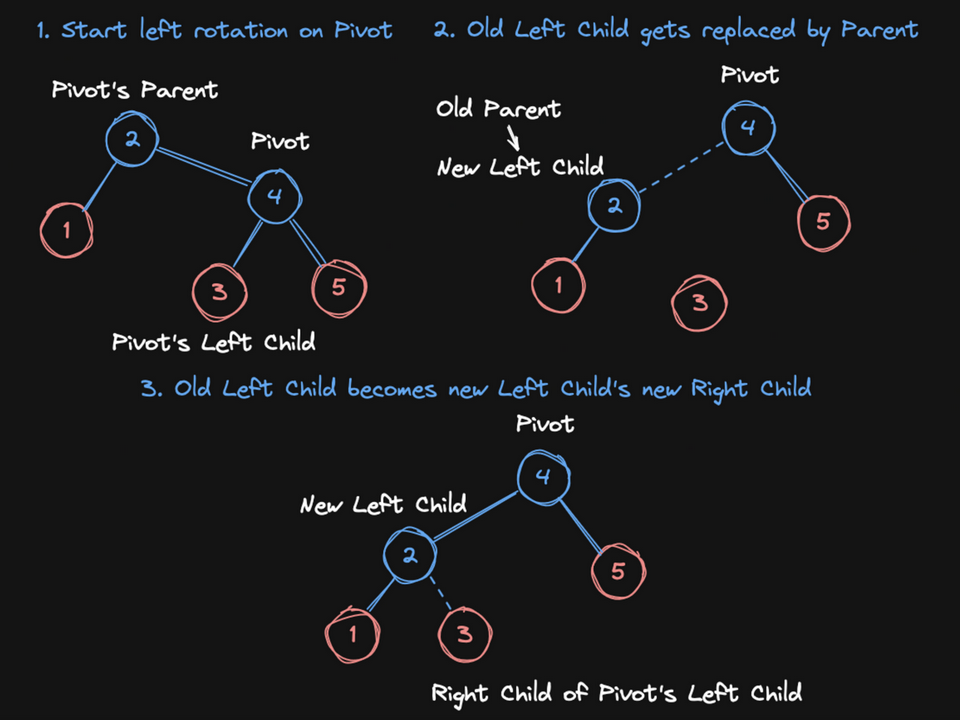

# Rotation

"Rotations" are what actually *keep* a red-black tree balanced. Every time one branch of the tree starts to get too long, we will "rotate" those branches to keep the tree shallow. A shallow tree is a healthy (fast) tree!

- A properly-ordered tree pre-rotation remains a properly-ordered tree post-rotation
- Rotations are `O(1)` operations
- When rotating left:
    - The "pivot" node's initial parent becomes its left child
    - The "pivot" node's old left child becomes its initial parent's new right child

Here's the process of a "left rotation":

## Assignment

Now that we can add users to our new Red Black Tree, we need to add the rotation functionality that will keep it balanced and running fast!

<blockquote style="border-left: 5px solid #33e865; padding: 5px 10px; margin: 10px auto">
Use the exact same variables as specified in the instructions. For example, <code>pivot_parent</code> and <code>pivot.parent</code> are <strong>not</strong> interchangeable as they hold state that changes throughout the algorithm's steps.
</blockquote>

- [ ] **Complete the `rotate_left` method**. It takes a single node, `pivot_parent`, as input and rotates the tree with its pivot node — which in this case is its right child.
   1. [ ] If `pivot_parent` is `nil` or `pivot_parent`'s right child is `nil`, **`return`**. Nothing to do here.
   2. [ ] Let `pivot` be `pivot_parent`'s right child.
   3. [ ] Set `pivot_parent`'s right child to be `pivot`'s left child.
   4. [ ] If `pivot`'s left child isn't a `nil` leaf node, set `pivot`'s left child's parent to `pivot_parent`.
   5. [ ] Set `pivot.parent` to `pivot_parent`'s parent.
   6. [ ] If `pivot_parent` is the root: 
      - [ ] set the `root` to `pivot`.
      - [ ] `elif pivot_parent is pivot_parent.parent.left:`, set `pivot_parent.parent.left` to `pivot`.
      - [ ] `elif pivot_parent is pivot_parent.parent.right:`, set `pivot_parent.parent.right` to `pivot`.
   7. [ ] Set `pivot.left` to be `pivot_parent`.
   8. [ ] Set `pivot_parent.parent` to be `pivot`.

- [ ] **Complete the `rotate_right` method** with all the directionality inverted.