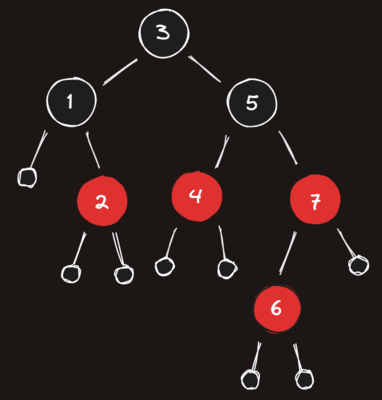

# Red-Black Tree Quiz

### Red-Black Tree Rules

1. Each node is either red or black
2. The root is black. This rule is sometimes omitted. Since the root can always be changed from red to black, but not necessarily vice versa, this rule has little effect on analysis.
3. All Nil leaf nodes are black.
4. If a node is red, then both its children are black.
5. All paths from a single node go through the same number of black nodes in order to reach any of its descendant NIL nodes.

---

### Is the tree displayed a valid red-black tree?

- ( ) Yes
- ( ) No, it breaks rule #5
- (x) No, it breaks rule #4
- ( ) No, it breaks rule #3

### To be a valid RB tree, a black node must have red children

- ( ) True
- ( ) False (they must be black as well)
- (x) False (it doesn't matter)