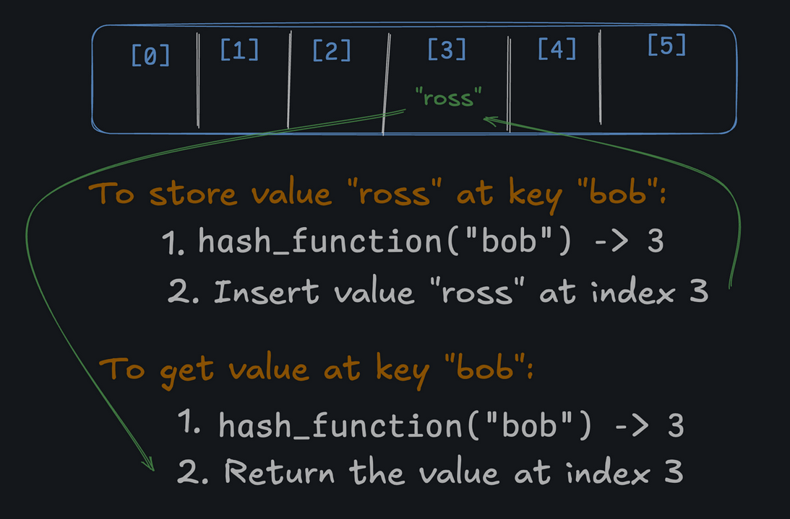

# Hashmaps

A [hash map](https://en.wikipedia.org/wiki/Hash_table) or "hash table" is a data structure that maps keys to values:

```
"bob" -> "ross"
"pablo" -> "picasso"
"leonardo" -> "davinci"
```

The lookup, insertion, and deletion operations of a hashmap have an average computational cost of `O(1)`. Assuming you know the key, nothing beats a hashmap! A Python dictionary is an example of a hashmap. See, you already know what a hashmap is!

### Under the Hood

While hashmaps are simple to use - you're already proficient with them if you know how to use a Python dictionary - the *implementation* is a bit trickier.

Hashmaps are built on top of arrays (or in the case of ours, a Python list). They use a [hash function](https://www.boot.dev/blog/computer-science/how-sha-2-works-step-by-step-sha-256/) to convert a "hashable" key into an index in the array. From a high-level, all that matters to us is that the hash function:

1. Takes a key and returns an integer.
2. Always returns the same integer for the same key.
3. Always returns a valid index in the array (e.g. not negative, and not greater than the array size)



Ideally the hash function hashes each key to a *unique* index, but most hash table designs employ an *imperfect* hash function, which might cause hash [collisions](https://en.wikipedia.org/wiki/Hash_collision) where the hash function generates the same index for more than one key. An example of a collision in the above example would be "bob" and "leonardo" both hashing to index 3. Ideally "leonardo" would hash to some other index, like 2.

Such collisions are typically accommodated for, and are *not* a problem in practice.

---

### Hash maps use ____ under the hood

- ( ) Red Black Trees
- ( ) Queues
- ( ) Binary Trees
- (x) Arrays

### What is the Big O complexity to iterate over all the keys and values in a hash map? (Hint: This is a trick question)

- ( ) O(n^2)
- (x) O(n)
- ( ) O(log(n))
- ( ) O(1)

### Hash maps can (in most cases) map ____ keys to ____ values

- ( ) string, string
- ( ) string, any
- ( ) int, any
- (x) hashable, any