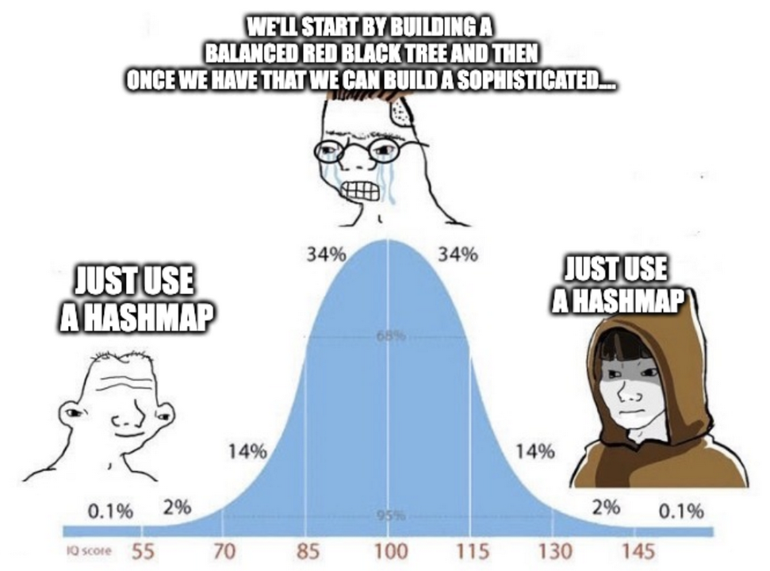

# Hash Map Review

Hashmaps are **awesome**. They are simple to use and have an average computational cost of `O(1)` for lookup, insertion, and deletion operations.



In Python, that means dictionaries. In Go, it means maps. In JavaScript, it means object literals. The point is, if you need an in-memory key-value store, hashmaps are awesome, and every language tends to have a built-in implementation.

### Properties of a *Good* Hash Map

- **Fast Lookups**: Hashmaps have an average time complexity of `O(1)` for lookups, insertions, and deletions.
- **Unordered**: Hashmaps (typically) do not guarantee any particular order of keys.
- **No Ranging**: While hashmaps are great for lookups, they don't provide the ability to look into a *range* of keys (e.g. the largest ten keys). That's one reason production databases like Postgres use binary trees for indexing.
- **Collision Resistant**: Hashmaps are built on top of arrays and use a hash function to convert a key into an index. Production-ready implementations (like Python dictionaries) handle hash collisions and make them a non-issue in practice.
- **Hashable Keys**: Keys must be hashable. This means they must be immutable and have a consistent hash value. For example, in Python, a tuple can be a key, but a list cannot.
- **Efficient Resizing**: When a hashmap's capacity is exceeded, it dynamically resizes (usually by doubling in size) and rehashes the elements. A good hashmap manages this resizing efficiently, minimizing performance hits.
- **Uniform Distribution**: A good hash function ensures keys are distributed evenly across the hashmap's underlying array, minimizing the number of collisions and optimizing lookup speed.

### Our Toy Hashmap

```python
def key_to_index(self, key):
    sum = 0
    for c in key:
        sum += ord(c)
    return sum % len(self.hashmap)
```

Has a few big problems, but at least it's valuable for understanding the concepts. Some of its big problems are:

- It doesn't resize when it gets too full, and doesn't handle collisions
- Its hash function is simplistic and doesn't distribute keys evenly

---

### What happens in our toy hash map if 'ab' and 'ba' are both used as keys?

- (x) They would collide because they have the same unicode sum
- ( ) The program would crash
- ( ) The data would be stored in the key 'ba' because it's bad ass
- ( ) The data would be stored in the key 'ab' because it comes first alphabetically

### Which is a major drawback of our hash map as opposed to a more robust implementation?

- ( ) Its basic insert and get operations are slower than O(1)
- ( ) It isn't ordered and doesn't support range lookups
- (x) It allocates a large List in memory even when we haven't filled all the indexes