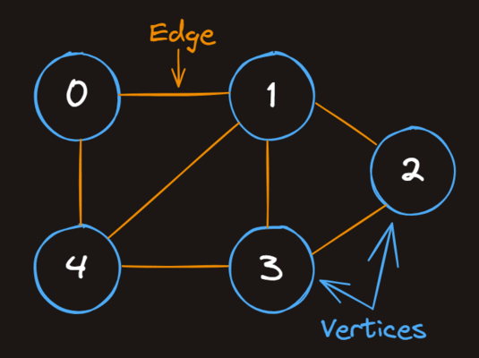

# Graph Review

When an algorithm traverses a graph, it typically moves across the *edges*.

### Common Use Cases

|   Use Case	    |   Vertex  	|   Edge    |
|   :---           |   :---       |   :---   |
|   Social Networks	|   User    	|   Connec  |
|   Road Maps   	|   Location	|   Road    |
|   Networks    	|   Computer	|   Cable   |
|   Game Dev    	|   Tile    	|   Path    |
|   AI Decision 	|   State   	|   Action  |

### Properties

- Graphs can have any number of vertices.
- An undirected graph can have up to `n(n - 1)/2` edges for `n` vertices.
- Vertices can exist without edges but may be disconnected (and thus kinda useless)
- Typically graphs (with the exception of multigraphs) can only have a single edge between two vertices
- Weighted graphs assign values (costs) to edges (we'll cover this in a future course)

---

### Graphs must have a root vertex

- ( ) True
- (x) False

### What is the maximum number of edges that an undirected graph can have?

- ( ) Slightly more than n, where n is the number of vertices
- (x) Slightly less than half of n^2, where n is the number of vertices
- ( ) Slightly less than n, where n is the number of vertices
- ( ) Slightly less than n^2, where n is the number of vertices

### What are the maximum number of edges that undirected graphs with 2, 3, and 4 vertices can have respectively?

- ( ) 2, 3, 8
- ( ) 2, 3, 6
- ( ) 1, 3, 8
- (x) 1, 3, 6