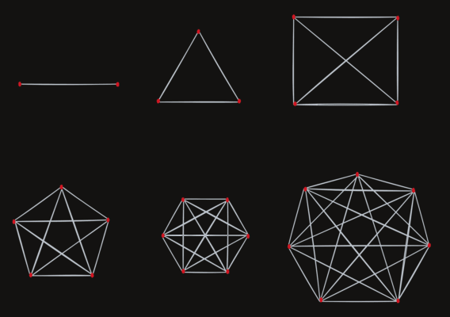

# Complete Graph

A *complete* graph is a graph where *every* pair of vertices is connected by an edge.

| Vertices | Edges |
| :---:    | :---: |
|   2   |	1   |
|   3   |	3   |
|   4   |	6   |
|   5   |	10  |
|   ... |	... |

The formula for the number of edges in a complete graph is `n(n - 1)/2`, where `n` is the number of vertices.

---

### How many edges will a complete graph with 6 vertices have?

- ( ) 20
- ( ) 18
- ( ) 16
- (x) 15

### A complete graph must have ____

- ( ) more vertices than edges
- ( ) more edges than vertices
- (x) edges connecting each pair of vertices
- ( ) a fraction of our power