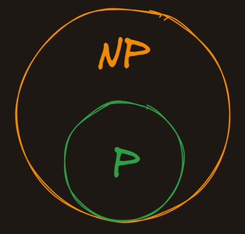

NP
[Nondeterministic polynomial time](https://en.wikipedia.org/wiki/NP_(complexity)), `NP`, is the set of problems whose solutions can be *verified* in [polynomial time](https://en.wikipedia.org/wiki/Time_complexity#Polynomial_time), but not necessarily *solved* in polynomial time.

### P Is in NP

Because all problems that can be *solved* in polynomial time can also be *verified* in polynomial time, all the problems in `P` are also in `NP`.

### The Oracle

A good way of thinking about problems in `NP` is to imagine that we have a magic oracle that gives us potential solutions to problems. Here would be our process for finding if a problem is in `NP`:

- Present the problem to the magic oracle
- The magic oracle gives us a potential solution
- We verify in polynomial time that the solution is correct

If we can do the verification in polynomial time, the problem is in `NP`, otherwise, it isn't.

---

### NP is a ____ of P

- (x) Superset
- ( ) Subset
- ( ) Sibling
- ( ) Disciple

### Solutions in NP can be ____ in polynomial time

- ( ) Yeeted
- ( ) Written
- (x) Verified
- ( ) Solved