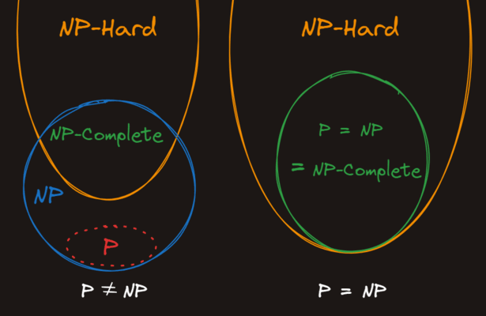

# NP-Hard

All `NP-complete` problems are [`NP-hard`](https://en.wikipedia.org/wiki/NP-hardness), but not all `NP-hard` problems are `NP-complete`. The determining factor between `NP-complete` and `NP-hard` is that *not all* `NP-hard` problems are in `NP`.

### Definition

<blockquote style="border-left: 5px solid #6c7db0; padding: 5px 10px; margin: 10px auto">
A problem is <code>NP-hard</code> if <em>every</em> problem in <code>NP</code> can be reduced into it in polynomial time.
</blockquote>

Compare this to the slightly different definition of `NP-complete`:

<blockquote style="border-left: 5px solid #6c7db0; padding: 5px 10px; margin: 10px auto">
A problem is <code>NP-complete</code> if it is in <code>NP</code> and <em>every other</em> problem in <code>NP</code> can be reduced into it in polynomial time.
</blockquote>

The difference is that `NP-complete` problems *must* be in `NP`, or in other words, they must be verifiable in polynomial time. `NP-hard` has no such restriction.

---

### NP-hard problems must ____ in polynomial time

- (x) have reductions from all NP problems
- ( ) be web scalable
- ( ) be verifiable
- ( ) be solvable

### All ____ problems are also ____

- ( ) NP-hard, NP-complete
- ( ) NP-hard, NP
- (x) NP-complete, NP-hard
- ( ) NP, NP-hard