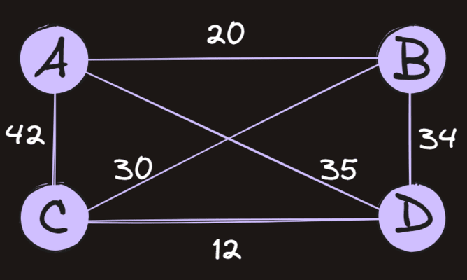

# Traveling Salesman Problem

A famous example of a problem in `NP` is the [Traveling Salesman Problem](https://en.wikipedia.org/wiki/Travelling_salesman_problem), also known as `TSP`.

The version of the problem that we will solve can be stated:

<blockquote style="border-left: 5px solid #6c7db0; padding: 5px 10px; margin: 10px auto">
Given a list of cities, the distances between each pair of cities, and a total distance, is there a path through all the cities that is less than the distance given?
</blockquote>



For example, with the above graph, the problem could be, "Is there a way to travel through A, B, C, and D in less than a distance of `67`?" The answer would be "yes" by way of `A -> B -> D -> C`

## Assignment

Our influencers need to travel to conferences to shill their sponsor's products! Since none of them trust Google Maps, they want to put in their proposed route to LockedIn, and we will tell them if their route is short enough to be worth their time (can you say feature creep?).

Complete the `tsp` function by performing a [brute-force search](https://en.wikipedia.org/wiki/Brute-force_search) using the provided algorithm. The brute-force search will, unfortunately, take factorial time, `O(n!)`, because you will need to try all possible paths and keep track of the shortest.

The provided `permutations()` will give you all the possible permutations of a list. For example, `permutations([0,1,2])` returns:

```python
[
  [0, 1, 2],
  [0, 2, 1],
  [1, 0, 2],
  [1, 2, 0],
  [2, 0, 1],
  [2, 1, 0]
]
```

### Pseudocode

#### Inputs:

- `cities`: A list of numbers starting from `0` that each represent a city.
- `paths`: A matrix where each point represents the distance between two cities.
- `dist`: The distance we are trying to beat.

Here's an example of the `paths` matrix (a list of lists). Each list represents the distance from that city to all the other cities. For example, `paths[0][1]` holds the distance from city `0` to city `1`. `paths[0][1]` = `paths[1][0]`

```python
paths = [
    [0, 12, 30], # list 0 shows the distance from city 0 to cities 0, 1 and 2
    [12, 0, 15], # list 1 shows the distance from city 1 to cities 0, 1 and 2
    [30, 15, 0], # list 2 shows the distance from city 2 to cities 0, 1 and 2
]

# all of the routes and their distances:

paths[0][1] # 12
paths[0][2] # 30
paths[1][2] # 15

# the shortest distance between all cities is from city 0 to city 1 to city 2, which is 27
```

#### Algorithm:

1. Use the `permutations` function to get the matrix of all possible paths through the given `cities`. Where the first path, `[0, 1, 2]` represents moving from `city 0 -> city 1 -> city 2`
2. Iterate over each possible path (permutation)
   1. Sum the distances between each city in the path using the `paths` matrix to look up the distances
   2. If the total distance of the path is less than the given `dist` return `True`
3. If no short paths were found, return `False`

<blockquote style="border-left: 5px solid #33e865; padding: 5px 10px; margin: 10px auto">
You'll want to use a nested loop here! An outer loop over all permutations (paths), and an inner loop to sum the distances of consecutive city pairs within a single path
</blockquote>

<blockquote style="background-color: #2a1c0d; border-left: 5px solid #d59d24; padding: 5px 10px; margin: 10px auto">
Be careful with <code>print</code> statements. They will drastically slow down your code.
</blockquote>