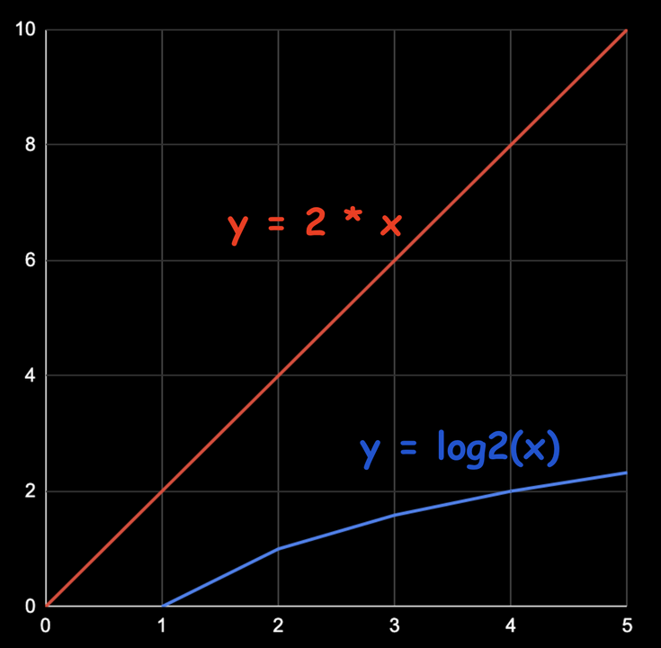

# Logarithm Quiz

<blockquote style="background-color: #041b2d; border-left: 5px solid #44a1ea; padding: 5px 10px; margin: 10px auto">
Exponents grow very quickly, and logarithms grow very slowly. A logarithm is the inverse of an exponent.
</blockquote>

Generally speaking, it's nice when we can write code that uses `log(n)` time to run, where `n` is the amount of data to process. For example, let's say we have a list of `1,000,000` users, and we want to write an algorithm that finds the user with the most followers.

If it takes `1` millisecond to check one user (let's just pretend), a linear algorithm would take `1,000,000` milliseconds, or about `16` minutes and `40` seconds.

A quadratic algorithm (exponent) would take `1,000,000,000,000` milliseconds, or about `31.7` years.

However, a logarithmic algorithm would only take `20` milliseconds! Here's a table to illustrate the difference:

|   Input Size  |	Linear (`n*2`)  |	Quadratic (`n^2`)   |	Log (`log2(n)`) |
|   --- |   --- |   --- |   --- |
|   10  |	20 ms   |	100 ms  |	3 ms    |
|   100 |	200 ms  |	10,000 ms   |	7 ms    |
|   1,000   |	2,000 ms    |	1,000,000 ms    |	10 ms   |
|   10,000  |	20,000 ms   |	100,000,000 ms  |	14 ms   |
|   100,000 |	200,000 ms  |	10,000,000,000 ms   |	17 ms   |
|   1,000,000   |	2,000,000 ms    |	1,000,000,000,000 ms    |	20 ms   |

---

## log3(9) = ?

- ( ) 6
- ( ) 3
- (x) 2

## log5(5) > 5^5

- ( ) True
- (x) False

## The result of which operation grows slowest?

- ( ) Multiplication
- (x) Logarithm
- ( ) Exponentiation