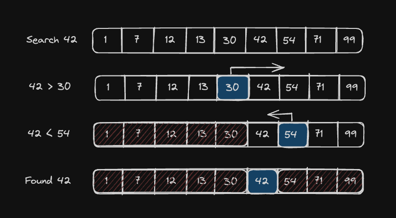

# Order Log N

`O(log(n))` algorithms are only slightly slower than `O(1)`, but much faster than `O(n)`. They do grow according to the input size, `n`, but only according to the log of the input.

`O(n)`:

|   n	|   time    |
|   --- |   --- |
|   8	|   8 ms    |
|   64	|   64 ms   |
|   1024    |	1024 ms |
|   1048576 |	1048576 ms  |

`O(log(n))`:

|   n   |	time    |
|   --- |   --- |
|   8   |	3 ms    |
|   64  |	6 ms    |
|   1024	|   10 ms   |
|   1048576	|   20 ms   |

### Binary Search

A [binary search algorithm](https://en.wikipedia.org/wiki/Binary_search) is a common example of an `O(log(n))` algorithm. Binary searches work on a **pre-sorted list** of elements.

### Pseudocode
Given two inputs:

1. A list of `n` elements sorted from least to greatest
2. A `target` value:

Do the following:

- Set low = 0 and high = `n - 1`.
- While `low <= high`:
    - Set median (the position of the middle element) to `(low + high) // 2`, which is the greatest integer less than or equal to `(low + high) / 2`
    - If `list[median] == target`, return `True`
    - Else if `list[median] < target`, set `low` to `median + 1`
    - Otherwise set `high` to `median - 1`
- Return `False`

At each iteration of loop, we halve the list. Which makes the algorithm `O(log(n))`. In other words, to add one more step to the runtime, we'd have to double the size of the input. Binary searches are *fast*.

## Assignment

We have a popular influencer using our LockedIn app, and she needs to be able to quickly search for posts from a particular day. This function will be the backbone of her search screen.

Complete the `binary_search` function. It should follow the algorithm as described above.

<blockquote style="border-left: 5px solid #33e865; padding: 5px 10px; margin: 10px auto">
The input array <code>arr</code> is already sorted for you!
</blockquote>