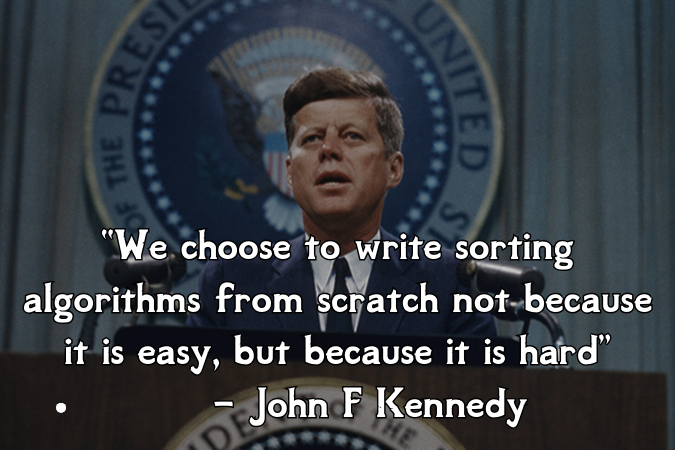

# Bubble Sort

Wait, if the standard `sorted()` function exists, why should we learn to write a sorting algorithm from scratch?

In all seriousness, in this chapter we'll be building some of the most famous sorting algorithms from scratch because:

- It's good to understand how they work under the hood
- It's great algorithmic thinking practice
- It's fun! (at least for me)

<blockquote style="background-color: #041b2d; border-left: 5px solid #44a1ea; padding: 5px 10px; margin: 10px auto">
[Bubble sort](https://en.wikipedia.org/wiki/Bubble_sort) is a very basic sorting algorithm named for the way elements "bubble up" to the top of the list.
</blockquote>

Bubble sort repeatedly steps through a slice and compares adjacent elements, swapping them if they are out of order. It continues to loop over the slice until the whole list is completely sorted. Here's the pseudocode:

1. Set `swapping` to `True`
2. Set `end` to the length of the input list
3. While `swapping` is `True`:
   1. Set `swapping` to `False`
   2. For `i` from the 2nd element to `end`:
      - If the `(i-1)`th element of the input list is greater than the `i`th element:
         1. Swap the `(i-1)`th element and the `i`th element
         2. Set `swapping` to `True`
    3. Decrement `end` by one
4. Return the sorted list

## Assignment
While our avocado toast influencers were happy with our search functionality, now they want to be able to sort all their followers by follower count. Bubble sort is a straightforward sorting algorithm that we can implement quickly, so let's do that!

Complete the `bubble_sort` function according to the described algorithm above.