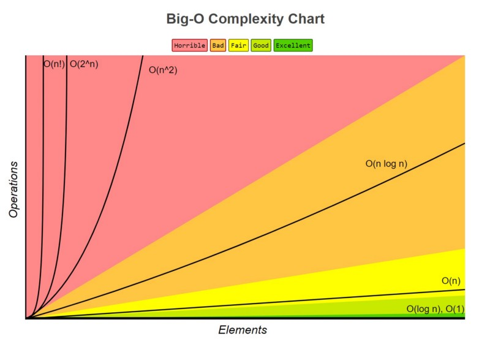

# Merge Sort Big O

Merge sort implementation reference:

```python
def merge_sort(nums):
    if len(nums) < 2:
        return nums
    first = merge_sort(nums[: len(nums) // 2])
    second = merge_sort(nums[len(nums) // 2 :])
    return merge(first, second)

def merge(first, second):
    final = []
    i = 0
    j = 0
    while i < len(first) and j < len(second):
        if first[i] <= second[j]:
            final.append(first[i])
            i += 1
        else:
            final.append(second[j])
            j += 1
    while i < len(first):
        final.append(first[i])
        i += 1
    while j < len(second):
        final.append(second[j])
        j += 1
    return final
```



---

## What is merge sort's Big O complexity?

- ( ) O(n^2)
- (x) O(n*log(n))
- ( ) O(n)
- ( ) O(log(n))