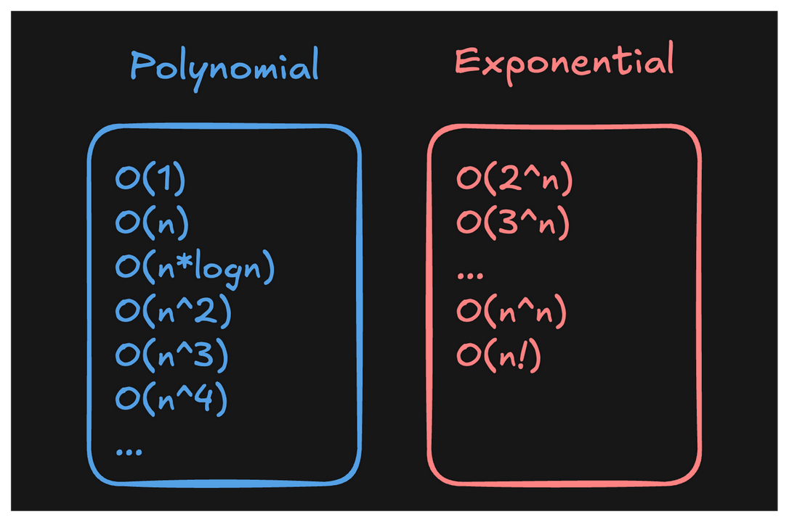

# Polynomial vs. Exponential

Broadly speaking, algorithms can be classified into two categories:

- "Polynomial time"
- "Exponential time"

*Technically `O(n!)` is "factorial" time, but let's lump them together for simplicity*

An algorithm runs in "Polynomial time" if its runtime does not grow faster than `n^k`, where `k` is any constant (e.g. `n^2`, `n^3`, etc) and `n` is the size of the input. Polynomial-time algorithms *can* be useful if they're not too slow.

In comparison, exponential-time algorithms are almost always too slow to be practical. (However, sometimes you're *trying* to force someone to be slow, like in the case of cryptography and security). Even when `n` is as low as `20`, `2^n` is already over a million!

|   n	|   n^2	|   2^n |
|   --- |   --- |   --- |
|   2	|   4	|   4   |
|   3	|   9	|   8   |
|   4	|   16	|   16  |
|   5	|   25	|   32  |
|   6	|   36	|   64  |
|   7	|   49	|   128 |
|   8	|   64	|   256 |
|   9	|   81	|   512 |
|   10	|   100	|   1024    |
|   11	|   121	|   2048    |
|   12	|   144	|   4096    |
|   13	|   169	|   8192    |
|   14	|   196	|   16384   |
|   15	|   225	|   32768   |
|   16	|   256	|   65536   |
|   17	|   289	|   131072  |
|   18	|   324	|   262144  |
|   19	|   361	|   524288  |
|   20	|   400	|   1048576 |

---

## Polynomial algorithms are ____ than exponential algorithms

- ( ) Slower
- ( ) More complicated
- ( ) Less complicated
- (x) Faster