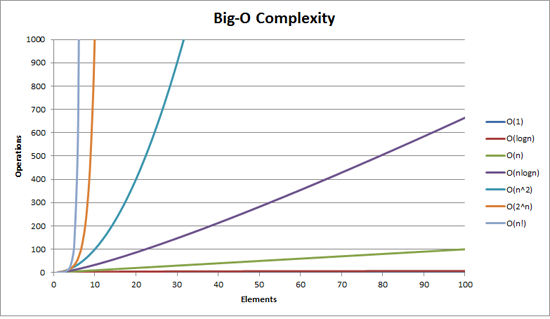

# Big O Categories Review

|   Big-O   |	Name    |   Description |
|   --- |   --- |   --- |
|   O(1)    |	constant    |	Best The algorithm always takes the same amount of time, regardless of how much data there is. Example: Looking up an item in a list by index
|   O(log(n))   |	logarithmic |	Great Algorithms that remove a percentage of the total steps with each iteration. Very fast, even with large amounts of data. Example: Binary search    |
|   O(n)    |	linear  |	Good 100 items, 100 units of work. 200 items, 200 units of work. This is usually the case for a single, non-nested loop. Example: unsorted array search.    |
|   O(n*log(n)) |	"linearithmic"  |	Okay This is slightly worse than linear, but not too bad. Example: mergesort and other "fast" sorting algorithms.   |
|   O(n^2)  |	quadratic   |	Slow The amount of work is the square of the input size. 10 inputs, 100 units of work. 100 Inputs, 10,000 units of work. Example: A nested for loop to find all the ordered pairs in a list.    |
|   O(n^3)  |	cubic   |	Slower If you have 100 items, this does 100^3 = 1,000,000 units of work. Example: A triple nested for loop to find all the ordered triples in a list.   |
|   O(2^n)  |	exponential |	Horrible We want to avoid this kind of algorithm at all costs. Adding one to the input doubles the amount of steps. Example: Brute-force guessing results of a sequence of n coin flips.    |
|   O(n!)   |	factorial   |	Even More Horrible The algorithm becomes so slow so fast, that it is practically unusable. Example: Generating all the permutations of a list   |

---

## Which algorithm tends to be fastest?

- ( ) O(n^2)
- ( ) O(n*log(n))
- (x) O(n)
- ( ) O(2^n)