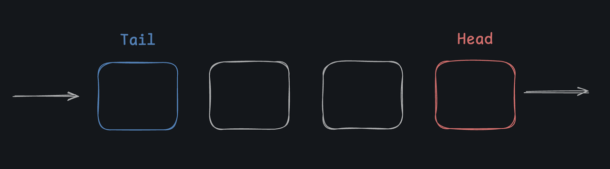

# What Is a Queue?

A queue stores ordered items... again, *kind of like* a list, but again, like a stack, its design is more **restrictive**. A queue only allows items to be *added to the tail* of the queue and *removed from the head* of the queue.

It's called a "queue" because it behaves like a queue of people waiting in line to order coffee.

The first person to get in line is also the first person to be served (get out of line). So, you'll often hear a queue referred to as a `FIFO` (first in, first out) data structure.

---

### Which is an example of a real-world queue?

- ( ) The set of possibilities in a game of dice
- (x) The absurdly long line of millennials without children waiting to get into DisneyLand
- ( ) Lane's collection of totally-cool and totally-not-lame LOTR action figures
- ( ) A stack of plates in a cafeteria