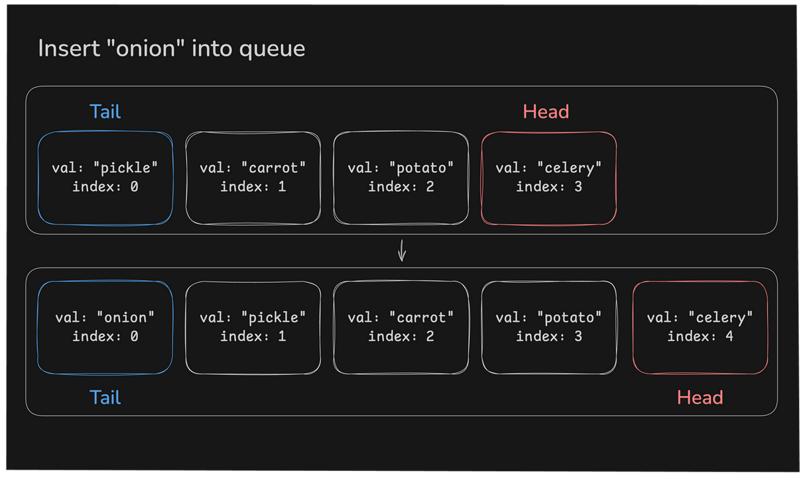

# Queue Speed

So how fast are queue operations? Well, in an optimized queue, they'd be:

|   Operation   |	Big O   |	Description |
|   :---:   |   :---:   |   :---                                                                 |
|   push	|   `O(1)`  |	Add an item to the back of the queue                                |
|   pop	    |   `O(1)`  |	Remove and return the front item from the queue                     |
|   peek	|   `O(1)`  |	Return the front item from the queue without modifying the queue    |
|   size	|   `O(1)`  |	Return the number of items in the queue                             |

Just like a stack, all operations are `O(1)`! No matter how many items are in the queue, these operations will always take the same amount of time. The reason to choose a queue over a stack is all about *ordering*. Queues should be used when you need to process items in *the order they were added*.

LIFO (stack) vs FIFO (queue).

### A Problem

Our current `Queue` class has a problem... take a look at the `push` method:

```python
def push(self, item):
    self.items.insert(0, item)
```

It's not `O(1)`! The List's `insert` method has to shift all the other items in the list down to make room for the new item.



We'll solve this very solvable problem soon...

---

### What is the Big O complexity of the push, pop, peek, and size operations of an optimized queue?

- ( ) O(n^2)
- ( ) O(n)
- ( ) O(log(n))
- (x) O(1)

### If an item could be anywhere in a queue, what is the Big O complexity to retrieve that item?

- (x) O(n) because you might have to pop all the items in the queue
- ( ) O(log(n)) because binary search can be used
- ( ) O(1) because the pop operation is O(1)
- ( ) O(-1) because I have psychic powers

### Why is our list-based queue's push operation O(n)?

- ( ) Because you have to search for the perfect spot to insert the new element.
- ( ) Because you have to remove everything from the queue before you can add a new element.
- (x) Because you have to move all the elements over by one index to make room for the new element.