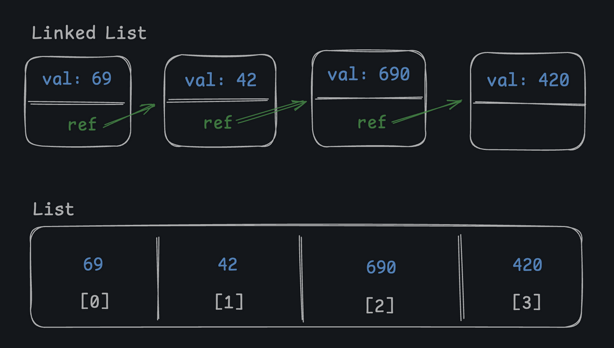
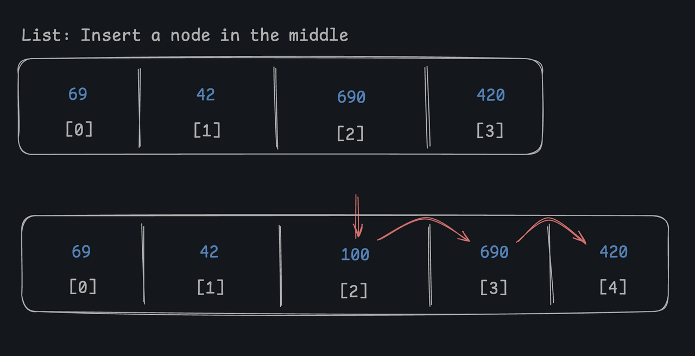
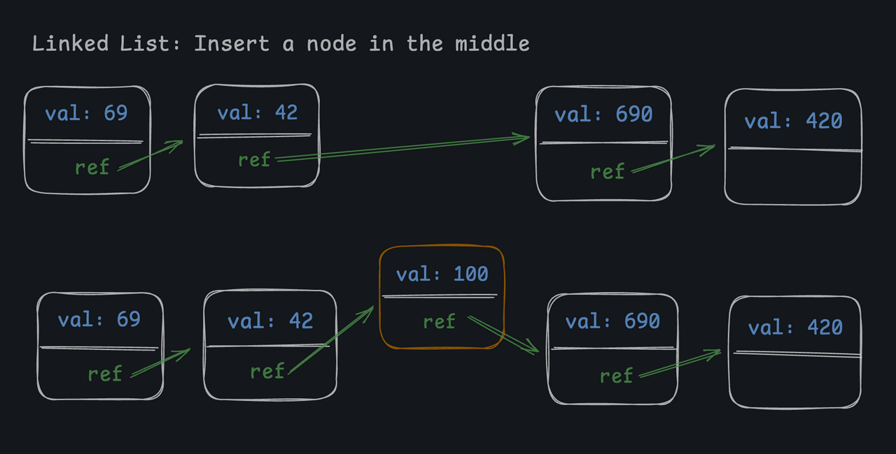

# Linked List vs. List

A linked list is a collection of ordered items, so it's similar to a "normal" list (also called an "array" or "slice" in other languages).



Items in a "normal" list are stored next to each other in memory, and to get an item from a normal `List` we have to use a numbered index:

```python
car = cars[3]
```

You can think of the "index" as simply an offset from the start. The `cars` list in this example refers to the start of the list, and `3` is just the 4th item in that section of memory. With a normal list, all the data is stored in the same place in memory and the index is just a way to find the right spot.

In a linked list, ***there are no indexes***! Each node contains two things: the data itself, and a *reference* to the next node in the list. Iterating over a linked list requires starting at the head node and following the `next` references until you reach the end.

```python
current_car_node = head_car_node
while current_car_node is not None:
    print(current_car_node.val)
    current_car_node = current_car_node.next
```

Frankly, linked lists can be annoying to use and incur more overhead, **so why use a linked list at all**? It's because *sometimes* linked lists are much faster to make updates to, ***particularly when inserting or deleting items from the middle***.

In a normal list, if you insert an item in the middle, you have to shift *all* the items after it down one spot, which takes O(n) time:



In a linked list, once you've traversed to a given node, insertion is (O(1)) because you can simply update two references:



---

### You can find an item in a linked list by...

- ( ) Sending up thoughts and prayers
- ( ) Popping an item off the list
- (x) Iterating through all the nodes by following the 'next' references
- ( ) Indexing directly to the item with an index number

### Linked lists have a faster time complexity than regular lists when it comes to...

- ( ) Iterating through the list
- (x) Inserting/deleting items in the middle of the list
- ( ) Appending items to the end of the list
- ( ) Accessing items by index